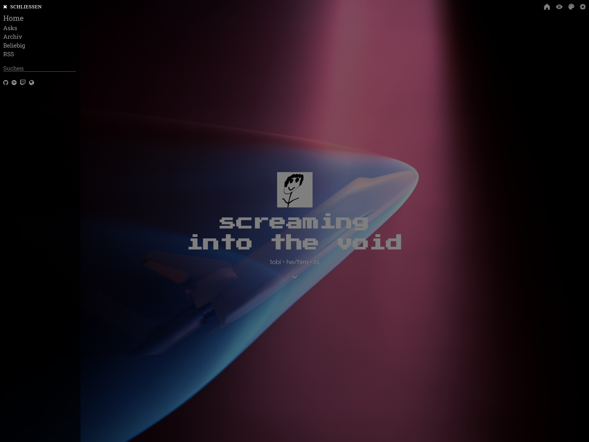

# tumblr-themes

a collection of tumblr themes i made, in action for example [here](https://cytobi.tumblr.com/) and [here](https://cytobis-ai-image-stuff.tumblr.com/)

## folder structure

- blog1
  - date
    - theme.html
    - custom.css
    - settings.md
  - YYYY-MM-DD
    - theme.html
    - custom.css
    - settings.md
    - assets
      - header_image.png
- blog2
  - ...
- screenshots
  - blog1_position.png
  - blog2_position.png
- README.md
- LICENSE

## screenshots

